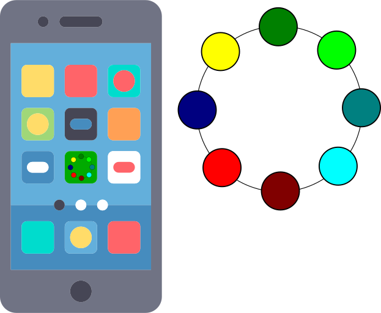

# Приложение для управления адресной лентой светодиодов с мобильного телефона при помощи ESP32
## Описание



Это приложение предназначено для управление через нешифрованный Bluetooth Low Energy устройством ESP32. Приложение управляет цветом и яркостью светодиодов, может включать различные режимы работы устройства. 
Программа для прошивки ESP32: [led_strip](https://github.com/GrandFatherPikhto/led_strip) 

## Добавить в AndroidManifest.xml

Разрешения для работы с Bluetooth.
```xml
    <uses-permission android:name="android.permission.BLUETOOTH"/>
    <uses-permission android:name="android.permission.BLUETOOTH_SCAN" />
    <uses-permission android:name="android.permission.BLUETOOTH_CONNECT" />
    <uses-permission android:name="android.permission.BLUETOOTH_ADMIN"/>
    <uses-permission android:name="android.permission.ACCESS_FINE_LOCATION"/>
    <uses-permission android:name="android.permission.ACCESS_COARSE_LOCATION" />
    <uses-permission android:name="android.permission.ACCESS_BACKGROUND_LOCATION"/>
```
Для того, чтобы сервис мог запуститься, необходимо добавить описание сервиса:
```xml
<service android:name=".service.BluetoothLeService" android:enabled="true" />
```
## Запрос разрешений на сканирование и подключение к Bluetooth
В приложении запрашивается целая группа разрешений (permissions). Многие из них "перекрывают" друг-друга. Разрешения бывают двух типов: "нормальный" (normal) и "опасный" (dangerous). Нормальные разрешения автоматически запрашиваются через AndroidManifets.xml, разрешения "опасного" уровня необходимо запрашивать программно.
В этой программе они запрашиваются из MainActivity. Просто, затем, чтобы не загромождать сервис, хотя, теперь код MainActivity "раздулся".
[Полный список "разрешений" (permissions)](https://developer.android.com/reference/android/Manifest.permission)

